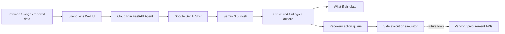

# SpendLens — Gemini Financial Digital Twin

SpendLens is an autonomous SaaS and AI spend-recovery agent built for the **All Things Agentic Hackathon**. It turns a messy software stack into a quantified recovery plan: detect overlap, right-size seats, flag renewal risk, simulate alternatives, and produce an execution-ready action queue.

## Why it exists

Teams accumulate SaaS and AI subscriptions faster than they can govern them. The result is duplicated tools, inactive seats, oversized plans, and missed renewals. Traditional expense dashboards show what was spent. SpendLens decides what to do next.

## Agent workflow

1. Ingest SaaS/AI subscription and usage records.
2. Normalize annual cost and utilization.
3. Use **Gemini 3.5 Flash** to reason across overlap, usage, renewal timing and workflow risk.
4. Produce structured findings, savings estimates and what-if scenarios.
5. Rank actions into **Do today / Do this week / Before renewal**.
6. Convert approved actions into an execution manifest. The demo uses safe simulation; vendor/procurement APIs can be attached as tools for real mutations.

## Required Google stack

- **Gemini 3.5 Flash** (`gemini-3.5-flash`)
- **Google GenAI SDK** (`google-genai >= 2.0.0`) — qualifying Google agent framework
- **Google Cloud Run** — containerized backend infrastructure

## Architecture



## Local run

```bash
cd spendlens-agentic
python -m venv .venv
source .venv/bin/activate
pip install -r requirements.txt
export GEMINI_API_KEY="YOUR_KEY"
uvicorn main:app --reload --port 8080
```

Test:

```bash
curl http://localhost:8080/health
curl http://localhost:8080/sample
curl -X POST http://localhost:8080/analyze \
  -H 'Content-Type: application/json' \
  -d '{}'
```

## Deploy to Google Cloud Run

Prerequisites: a Google Cloud project with billing enabled and the `gcloud` CLI authenticated.

```bash
gcloud config set project YOUR_PROJECT_ID
gcloud services enable run.googleapis.com cloudbuild.googleapis.com

gcloud run deploy spendlens-agent \
  --source . \
  --region asia-northeast1 \
  --allow-unauthenticated \
  --set-env-vars GEMINI_API_KEY=YOUR_GEMINI_API_KEY,GEMINI_MODEL=gemini-3.5-flash
```

For production, store the key in Secret Manager rather than a plain environment variable.

After deployment, verify:

```bash
curl https://YOUR_CLOUD_RUN_URL/health
```

The hackathon demo video should visibly show the Cloud Run service and then call the `/analyze` endpoint so judges can see that the production backend is actually running on Google Cloud.

## API

- `GET /health` — liveness + model proof
- `GET /sample` — sample SaaS stack
- `POST /analyze` — autonomous Gemini analysis
- `POST /execute` — converts approved recommendations to a safe execution plan

## Demo story

A sample company spends **$11,320/year** across overlapping AI, automation, design and collaboration tools. SpendLens analyzes the stack, identifies recoverable spend, models alternatives, and generates a prioritized recovery plan in one flow.

## Safety and production design

SpendLens separates **decisioning** from **mutation**. Gemini can propose and rank actions, but irreversible vendor changes should require explicit approval and scoped credentials. This prevents an autonomous optimization agent from cancelling critical services based on uncertain evidence.

## Hackathon category

**The Taskmaster** — a complete multi-step workflow that performs spend analysis, decisioning, scenario modeling and execution planning rather than acting as a text chatbot.
